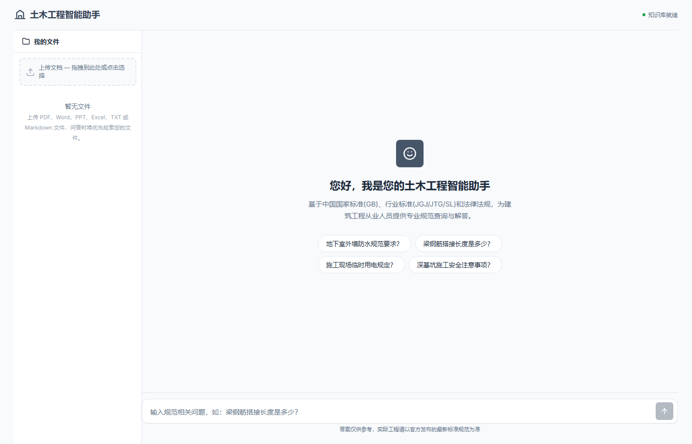
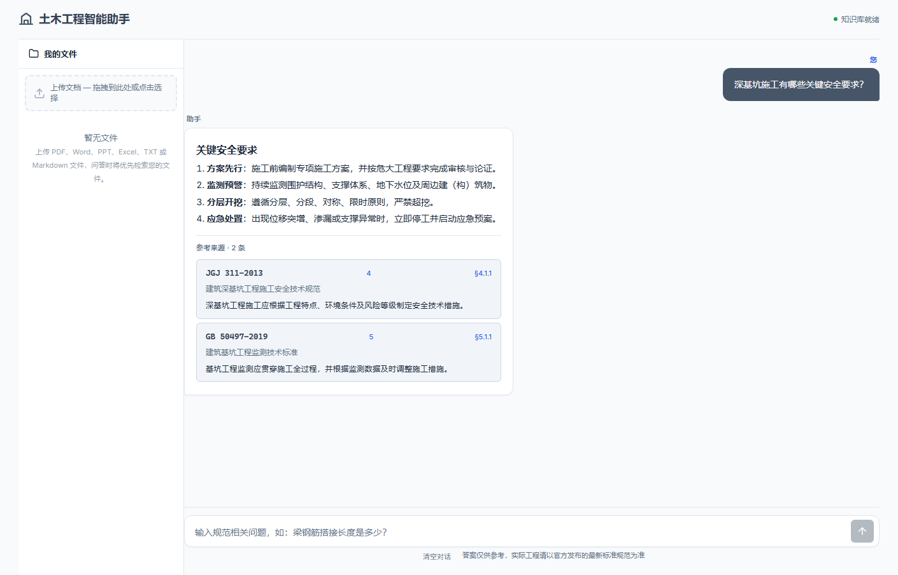
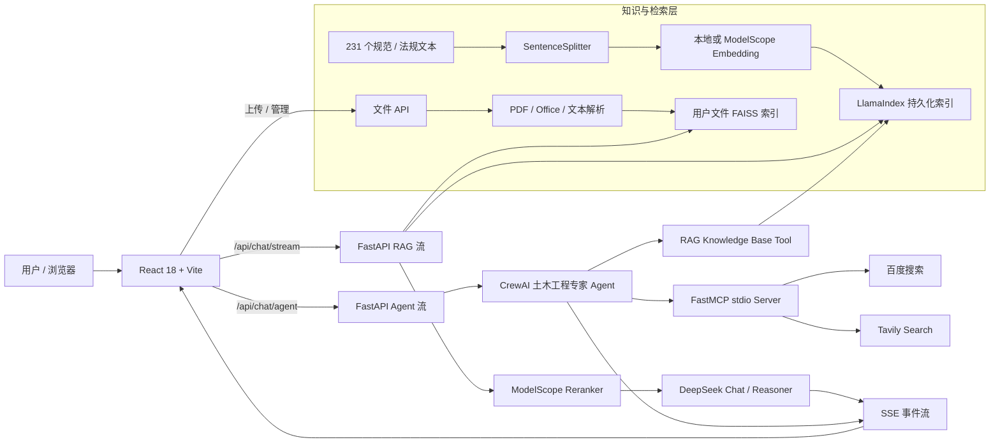
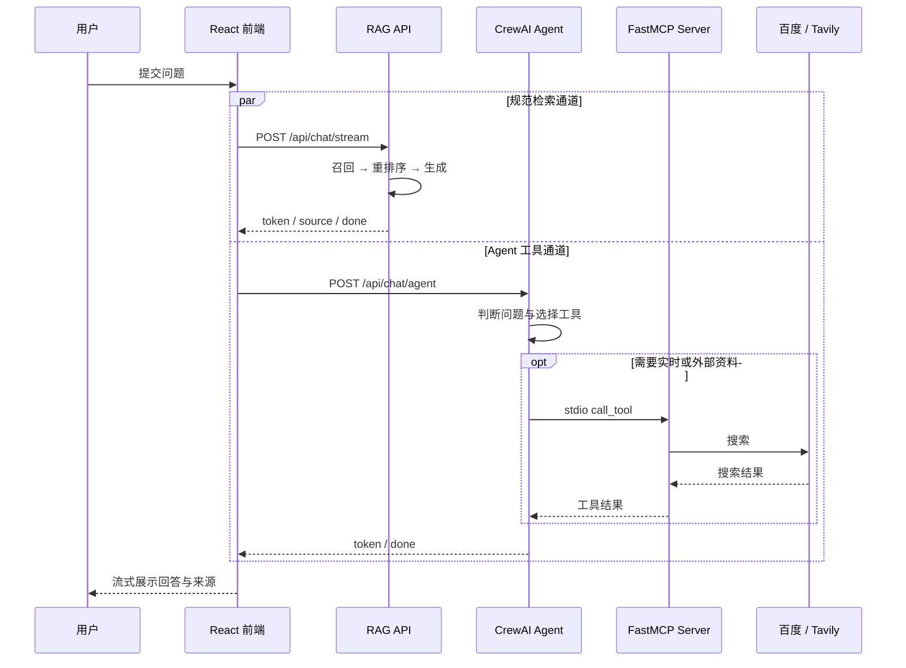

<div align="center">

# 🏗️ 土木工程智能助手

**面向建筑工程从业者的规范知识库问答系统：用 RAG 提供可追溯依据，用 CrewAI + MCP 补充联网检索。**


</div>



## 项目简介

工程规范分散在国家标准、行业标准、地方标准和法律法规中，现场人员往往需要在多个文档间反复检索。本项目将规范文本构建为本地向量知识库，在回答中展示标准编号、章节、条款和原文片段；当问题需要实时信息时，CrewAI Agent 还能通过 MCP 调用百度或 Tavily 搜索。

仓库当前包含 **231 个规范/法规文本文件**，覆盖 GB、JGJ、JTG、SL、地方标准及建设工程相关法规；根目录的 `规范清单-200项.csv` 用于维护 200 项标准目录。

> 本项目提供辅助检索与信息整理，不替代正式规范、注册工程师判断或项目审批流程。

## 目录

- [为什么做这个项目](#为什么做这个项目)
- [核心功能](#核心功能)
- [界面展示](#界面展示)
- [系统架构](#系统架构)
- [Agent 与 MCP 工作流](#agent-与-mcp-工作流)
- [RAG 实现原理](#rag-实现原理)
- [技术栈](#技术栈)
- [快速开始](#快速开始)
- [使用方式](#使用方式)
- [验证与评估](#验证与评估)
- [项目结构](#项目结构)
- [安全边界与已知限制](#安全边界与已知限制)
- [Roadmap](#roadmap)

## 为什么做这个项目

- **检索成本高**：规范数量多、篇幅长，人工定位条款耗时。
- **答案缺少依据**：通用大模型可能给出结论，却无法稳定提供可核查的标准来源。
- **项目资料割裂**：企业制度、专项方案和公开规范通常分开存放，难以统一检索。
- **实时信息易过期**：规范知识库适合稳定知识，但天气、新闻和最新技术资料需要联网补充。

项目的目标不是让模型“记住规范”，而是让每次回答尽可能建立在检索到的文本之上，并把引用证据交给用户复核。

## 核心功能

| 能力 | 当前实现 |
| --- | --- |
| 规范知识库 | 231 个文本文件，覆盖国家标准、行业标准、地方标准、技术规程和法律法规 |
| RAG 问答 | LlamaIndex 检索，`top_k=10` 召回，ModelScope Rerank 后保留 5 条 |
| 可追溯引用 | 回答下方展示标准编号、标准名称、章节、条款、原文片段和相关度 |
| 用户文件知识库 | 支持 PDF、DOCX、PPTX、XLSX、TXT、Markdown，单文件上限 50 MB |
| 本地向量检索 | 默认使用 `BAAI/bge-small-zh-v1.5`；用户文件以 FAISS 持久化 |
| Agent 工具调用 | CrewAI 土木工程专家 Agent 可调用规范 RAG、百度搜索、Tavily 搜索 |
| MCP 联网搜索 | FastMCP 以 stdio 子进程暴露 `baidu_search` 与 `tavily_search` |
| 流式交互 | FastAPI 通过 SSE 输出回答、推理事件与引用，React 实时渲染 |
| 对话体验 | 快捷问题、Markdown 回答、历史记录、可折叠文件面板与来源卡片 |

## 界面展示

### 规范问答与来源引用



上图使用演示问题呈现当前前端的回答与引用卡片样式；实际答案、评分和条款取决于本地索引、模型配置与运行时检索结果。

### 用户文件

左侧“我的文件”支持拖拽或点击上传。文件会经历解析、分块、向量化和本地持久化，随后可参与检索。当前代码中，用户文件与标准库的联合检索在 `USE_REASONING=true` 时启用。

## 系统架构



系统由三条数据路径组成：

1. **标准知识库**：规范文本经切分和向量化后持久化为 LlamaIndex 索引。
2. **用户文件库**：用户文档单独解析并写入 FAISS，避免与公共规范索引混在一起。
3. **联网工具**：Agent 通过 MCP 子进程调用搜索工具，补充知识库之外或具有时效性的资料。

## Agent 与 MCP 工作流

当前版本采用 **1 个 CrewAI 土木工程专家 Agent**，不是 LangGraph 多 Agent 架构。前端会同时发起 RAG 与 Agent 两条流式请求：RAG 通道提供规范回答与引用，Agent 通道根据问题决定是否调用知识库或联网搜索工具。



### MCP 工具

| 工具 | 用途 | 配置 |
| --- | --- | --- |
| `baidu_search` | 国内工程资料与中文网页搜索 | 无 API Key；可用性受百度页面与网络环境影响 |
| `tavily_search` | 最新技术资料与结构化互联网搜索 | 需要 `TAVILY_API_KEY` |
| `knowledge_base_search` | 检索本地土木工程规范并返回引用 | 需要已构建的知识库索引 |

## RAG 实现原理

### 1. 离线索引

```text
规范文本
  → 元数据解析（标准编号 / 名称 / 章节 / 条款）
  → SentenceSplitter（chunk_size=512, overlap=64）
  → BAAI/bge-small-zh-v1.5 或 ModelScope Embedding
  → LlamaIndex 向量索引
  → backend/storage/ 持久化
```

### 2. 在线查询

```text
用户问题
  → 标准库召回 top_k=10
  → 用户文件 FAISS 召回 top_k=5（推理模式）
  → ModelScope Qwen3-Reranker-8B 重排序，保留 top_n=5
  → 拼接检索上下文
  → DeepSeek 生成回答
  → SSE 返回回答与来源卡片
```

- Rerank API 不可用时会降级为原始向量排序。
- `EMBEDDING_MODE=local` 是默认配置；首次运行会下载约 100 MB 的中文 Embedding 模型。
- `USE_REASONING=true` 会切换到 `deepseek-reasoner`，并启用标准库与用户文件的联合检索。

## 技术栈

| 层级 | 技术 |
| --- | --- |
| 前端 | React 18、Vite 5、Marked、DOMPurify |
| 后端 | Python 3.10+、FastAPI、Uvicorn、Pydantic |
| LLM | DeepSeek Chat / DeepSeek Reasoner |
| Agent | CrewAI |
| MCP | MCP Python SDK、FastMCP、stdio transport |
| RAG | LlamaIndex、Sentence Transformers |
| Embedding | `BAAI/bge-small-zh-v1.5`（本地）或 `Qwen/Qwen3-Embedding-8B`（ModelScope） |
| Rerank | `Qwen/Qwen3-Reranker-8B`（ModelScope API） |
| 向量存储 | LlamaIndex 持久化索引、FAISS |
| 文档解析 | PyMuPDF、python-docx、python-pptx、openpyxl |
| 传输 | REST + Server-Sent Events |

## 快速开始

### 环境要求

- Python 3.10+
- Node.js 18+
- npm 9+
- DeepSeek API Key
- 可选：ModelScope API Key、Tavily API Key

### 1. 获取项目

```bash
git clone <repository-url>
cd <repository-directory>
```

如果已经下载项目，直接进入项目根目录即可。

### 2. 配置后端环境

Windows PowerShell：

```powershell
python -m venv backend/venv
.\backend\venv\Scripts\Activate.ps1
python -m pip install --upgrade pip
pip install -r backend/requirements.txt
pip install crewai mcp fastmcp tavily-python
```

macOS / Linux：

```bash
python3 -m venv backend/venv
source backend/venv/bin/activate
python -m pip install --upgrade pip
pip install -r backend/requirements.txt
pip install crewai mcp fastmcp tavily-python
```

> Agent 与 MCP 的四个依赖目前尚未写入 `backend/requirements.txt`，因此需要执行上面的补充安装命令。

### 3. 配置环境变量

```powershell
Copy-Item .env.example .env
```

macOS / Linux 使用 `cp .env.example .env`。至少填写：

```ini
DEEPSEEK_API_KEY=your_deepseek_api_key
EMBEDDING_MODE=local
USE_REASONING=false
```

可选能力：

```ini
# ModelScope Embedding 或 Rerank
MODELSCOPE_API_KEY=your_modelscope_api_key

# MCP Tavily 搜索
TAVILY_API_KEY=your_tavily_api_key
```

不要提交 `.env`。项目的 `.gitignore` 已忽略该文件。

### 4. 构建知识库索引

```powershell
cd backend
python scripts/build_index.py
```

常用参数：

```powershell
python scripts/build_index.py --status   # 查看索引状态
python scripts/build_index.py --rebuild  # 强制重建
```

### 5. 安装前端依赖

在项目根目录新开一个终端：

```powershell
cd frontend
npm install
```

### 6. 启动服务

终端 1 — 后端：

```powershell
cd backend
python -m src.main
```

终端 2 — 前端：

```powershell
cd frontend
npm run dev
```

打开以下地址：

- Web 界面：<http://localhost:3000>
- API 文档：<http://localhost:8000/docs>
- 健康检查：<http://localhost:8000/api/health>

## 使用方式

### 查询规范

可从具体构件、施工环节、验收指标或安全场景提问，例如：

```text
梁钢筋搭接长度是多少？
地下室外墙防水有哪些规范要求？
深基坑施工应监测哪些项目？
施工现场临时用电有哪些强制要求？
```

### 使用自己的资料

1. 在左侧“我的文件”上传 PDF、Word、PPT、Excel、TXT 或 Markdown。
2. 等待文件解析和向量索引完成。
3. 将 `.env` 中的 `USE_REASONING` 设为 `true` 并重启后端。
4. 在问题中明确项目或文件语境，系统会优先拼接用户文件检索结果。

### 使用联网搜索

Agent 会根据任务描述选择百度、Tavily 或本地知识库。联网结果具有时效性和不确定性，涉及工程决策时仍应打开原始来源并人工复核。

## 验证与评估

当前仓库没有完整的单元测试、检索评测集或端到端质量指标。可以先运行以下基础检查：

```powershell
# 后端语法检查
cd backend
python -m compileall -q src

# 前端生产构建
cd ../frontend
npm run build
```

| 检查项 | 本次 README 更新时的结果 |
| --- | --- |
| Python 源码编译 | 未完全通过：`backend/src/agent/agent.py:9` 存在缺少参数分隔符的语法错误；该示例模块当前未被主入口引用 |
| FastAPI 应用导入与路由注册 | 通过，OpenAPI 中已注册 8 个 `/api` 路径 |
| React / Vite 生产构建 | 通过 |
| 页面渲染 | 通过，已生成上方两张界面截图 |
| RAG 正确率 / 引用命中率 | 尚未建立可复现评测集 |
| Agent 工具选择准确率 | 尚未量化 |

建议后续准备固定问答集，并至少记录 `Recall@K`、引用命中率、答案忠实度、P95 延迟和单次请求成本。

## 项目结构

```text
.
├── backend/
│   ├── scripts/                 # 数据下载、知识库初始化与索引脚本
│   ├── src/
│   │   ├── agent/               # Agent 辅助代码与 MCP 客户端示例
│   │   ├── api/                 # RAG、Agent、文件管理 API
│   │   ├── crew/                # CrewAI Agent、Task 与 Crew
│   │   ├── data/documents/      # 规范、规程与法规文本
│   │   ├── llm/                 # CrewAI 使用的 LLM 配置
│   │   ├── mcp_server/          # FastMCP 服务与搜索实现
│   │   ├── rag/                 # Embedding、索引、检索、Rerank、用户 FAISS
│   │   ├── tools/               # CrewAI 的 RAG / MCP Tool 封装
│   │   ├── config.py            # 全局配置
│   │   └── main.py              # FastAPI 入口
│   ├── storage/                 # 生成的索引（Git 忽略）
│   └── uploads/                 # 用户上传文件（Git 忽略）
├── frontend/
│   ├── src/api/                 # REST / SSE 客户端
│   ├── src/components/          # 问答、文件、消息与来源组件
│   └── src/App.jsx
├── design-system/               # Slate 视觉规范
├── docs/assets/readme/          # README 界面截图
├── .env.example                 # 环境变量模板
├── 规范清单-200项.csv            # 规范目录
└── README.md
```

## 安全边界与已知限制

- **没有用户认证与租户隔离**：当前适合本地开发或受控内网演示，不应直接暴露到公网。
- **没有人工审批 / RBAC / 审计流**：系统尚未实现高风险操作确认、角色权限或完整操作日志。
- **尚不支持多模态巡检**：图片型 PDF 无法提取文本，施工现场照片识别也未实现。
- **当前只有单 Agent**：仓库使用 CrewAI 单 Agent，并未实现 LangGraph 多 Agent 协作。
- **双通道输出仍需收敛**：前端并行接收 RAG 与 Agent 的 token，长回答可能出现输出顺序不稳定；更适合在后端统一编排后再输出。
- **用户文件参与条件**：目前仅在 `USE_REASONING=true` 的查询路径中合并用户文件结果。
- **外部服务依赖**：DeepSeek、ModelScope、Tavily 和百度的可用性、费用与内容质量不由本项目保证。
- **本地文件未加密**：上传文件和 FAISS 元数据保存在本机目录，部署时需要额外的访问控制、加密和生命周期策略。
- **规范时效性**：仓库中的文本不保证持续同步最新版，实际工程必须核对官方现行标准。

## Roadmap

- [ ] 将两条前端流收敛为后端可观测的统一编排流程
- [ ] 引入 LangGraph，多 Agent 分工完成检索、证据核验、回答与质量检查
- [ ] 增加施工巡检照片识别与多模态风险定位
- [ ] 增加人工确认节点、RBAC、审计日志和敏感操作策略
- [ ] 建立 RAG / Agent 固定评测集与自动回归报告
- [ ] 补齐后端依赖清单、容器化部署与 CI

## 贡献与许可

欢迎提交 Issue 或 Pull Request。提交前请确保不包含 API Key、用户上传文件、生成的索引或受版权保护的规范全文。

仓库目前未包含独立的 `LICENSE` 文件；公开分发或商业使用前，请先补充并确认合适的软件与数据许可。
